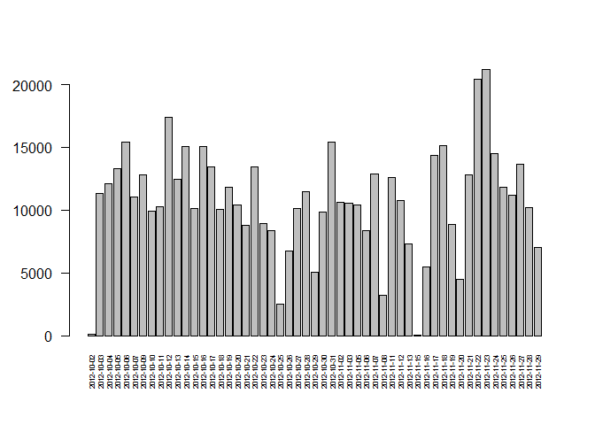
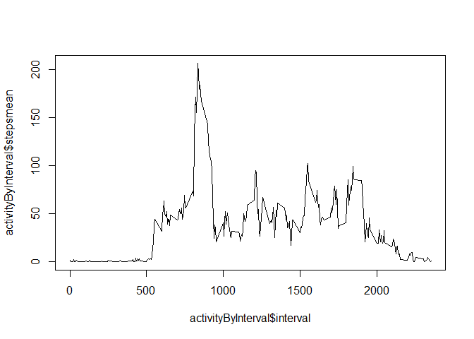
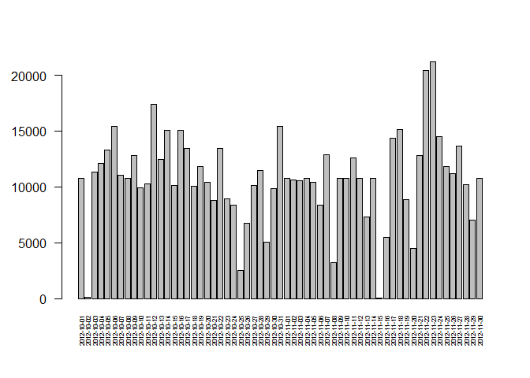
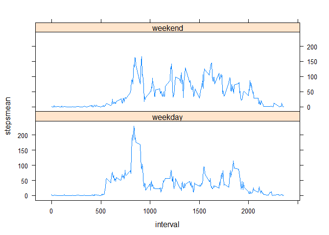

# Reproducible Research: Peer Assessment 1


## Loading and preprocessing the data
First lets read data from file "activity.zip" and store it in dataframe named "activity":

```r
activity <- read.csv(unz("activity.zip", "activity.csv"))
```

Lets look at the head of the data:

```r
head(activity)
```

```
##   steps       date interval
## 1    NA 2012-10-01        0
## 2    NA 2012-10-01        5
## 3    NA 2012-10-01       10
## 4    NA 2012-10-01       15
## 5    NA 2012-10-01       20
## 6    NA 2012-10-01       25
```

The data is in narrow form and it is OK for further analisys. We can admit that there are NA values in it.


## What is mean total number of steps taken per day?
For this part of assignment we will ignore the missing values in the dataset.
We will use dplyr package so lets load it. Be sure to install it first with `install.packages("dplyr")` if you do not have it already.

```r
library(dplyr)
```

Lets make a histogram of the total number of steps taken each day:

```r
activityByDate <- group_by(na.omit(activity), date) %>% summarise(steps = sum(steps))
barplot(activityByDate$steps, names.arg=activityByDate$date, cex.names=0.5, las=2)
```

 

Then lets calculate the mean and median total number of steps taken per day:

```r
mean(activityByDate$steps, na.rm = TRUE)
```

```
## [1] 10766.19
```

```r
median(activityByDate$steps, na.rm = TRUE)
```

```
## [1] 10765
```
## What is the average daily activity pattern?

Lets look at time series plot of the 5-minute intervals (x-axis) with average number of steps taken, averaged across all days (y-axis):

```r
activityByInterval <- group_by(na.omit(activity), interval) %>% summarise(stepsmean = mean(steps))
plot(activityByInterval$interval, activityByInterval$stepsmean, type="l")
```

 

The 5-minute interval that contains maximum number of steps on average across all the days is:

```r
activityByInterval$interval[activityByInterval$stepsmean == max(activityByInterval$stepsmean)]
```

```
## [1] 835
```

## Imputing missing values

Total number with missing values (by columns) is:

```r
sapply(activity, function(col) {sum(is.na(col))})
```

```
##    steps     date interval 
##     2304        0        0
```

As a simple strategy to impute missing values we will take means for that 5-minute intervals across all the days in the dataset.

```r
# generate sequence of intervals where NA are
intervalsToLookFor <- activity$interval[is.na(activity$steps)]

# generate sequence of row numbers from activityByInternal corresponding to intervalsToLookFor
rowNumbers <- match(intervalsToLookFor, activityByInterval$interval)

# extract sequence of steps means of the same length using rownumbers
means <- activityByInterval$stepsmean[rowNumbers]                             

#assign this means to NA values of main dataset
activity$steps[is.na(activity$steps)] <- means
```

Lets make a histogram of the total number of steps taken each day and calculate the mean and median total number of steps taken per day again:

```r
activityByDate <- group_by(na.omit(activity), date) %>% summarise(steps = sum(steps))
barplot(activityByDate$steps, names.arg=activityByDate$date, cex.names=0.5, las=2)
```

 

```r
mean(activityByDate$steps, na.rm = TRUE)
```

```
## [1] 10766.19
```

```r
median(activityByDate$steps, na.rm = TRUE)
```

```
## [1] 10766.19
```

Some days are added like 2012-10-01 or 2012-11-30, but the mean and median is pretty the same. We can see that now it is perfect normal destribution with mean = median.

## Are there differences in activity patterns between weekdays and weekends?
We will create a new factor variable in the dataset with two levels – “weekday” and “weekend” indicating whether a given date is a weekday or weekend day:

```r
#extracting weekdays as numbers where sunday = 0 and saturday = 6
weekdaysAsNum <- as.POSIXlt((as.Date(activity$date)))$wday

# constructing the factor variable and assigning it to new column "datetype"
weekdaysAsNum[weekdaysAsNum > 0 & weekdaysAsNum < 6] <- "weekday"
weekdaysAsNum[weekdaysAsNum == 0 | weekdaysAsNum == 6] <- "weekend"
activity$datetype <- factor(weekdaysAsNum)
```

Making a panel plot containing a time series plot of the 5-minute interval (x-axis) and the average number of steps taken, averaged across all weekday days or weekend days (y-axis). We will use lattice package for the plot, so be sure to have it otherwise install with ```install.packages("lattice")```

```r
library(lattice)
activityByInterval <- group_by(activity, interval, datetype) %>% summarise(stepsmean = mean(steps))
xyplot(stepsmean ~ interval | datetype, data = activityByInterval, layout = c(1,2), type = "l")
```

 
